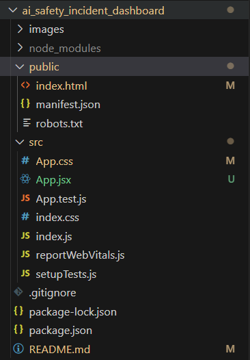
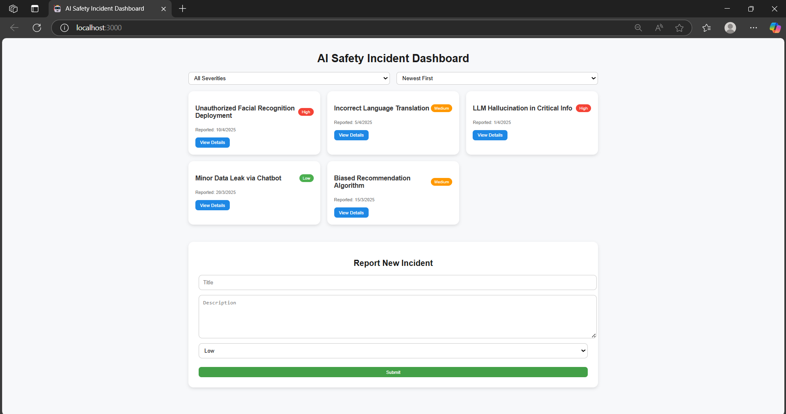

# AI Safety Dashboard

A web application built with React.js for monitoring and managing AI safety metrics and information.

## Problem Statement 

Task: Create an interactive "AI Safety Incident Dashboard" component. 

● Features: 
○ Display a list of mock AI safety incidents, showing Title, Severity, and Reported 
Date for each. 

●Implement filtering controls (e.g., buttons or dropdown) to filter the list by 
Severity ("All", "Low", "Medium", "High"). 

●Add sorting controls (e.g., buttons or dropdown) to sort the list by Reported 
Date (Newest First, Oldest First). 

●Add a "View Details" button/link for each incident. Clicking it should toggle the 
visibility of the full Description below the entry. Manage this 
expanded/collapsed state. 
 
●Include an "Report New Incident" form (can be always visible or toggled). The 
form should have inputs for Title, Description, and Severity (use dropdown or 
radio buttons for severity levels). 

●Submitting the form should add the new incident to the displayed list (updating the component's state). Basic input validation (e.g., non-empty fields) is a plus. 

●Ensure responsive layout (Flexbox/Grid preferred) and basic, clean styling with 
hover effects. 

● Mock Data Structure Example: 

[ 

{ "id": 1, "title": "Biased Recommendation Algorithm", "description": "Algorithm 
consistently favored certain demographics...", "severity": "Medium", 
"reported_at": "2025-03-15T10:00:00Z" }, 

{ "id": 2, "title": "LLM Hallucination in Critical Info", "description": "LLM provided 
incorrect safety procedure information...", "severity": "High", "reported_at": 
"2025-04-01T14:30:00Z" }, 

{ "id": 3, "title": "Minor Data Leak via Chatbot", "description": "Chatbot 
inadvertently exposed non-sensitive user metadata...", "severity": "Low", 
"reported_at": "2025-03-20T09:15:00Z" } 

] 

## Features

- Rich User Interface built with React components
- Single Page Application architecture
- Reusable components for maintainable code
- Responsive design with CSS

## Prerequisites

Before you begin, ensure you have met the following requirements:
- Node.js installed (v10 or higher recommended)
- npm (comes with Node.js) or yarn

# Method - 1 :- 

## Installation

To install and set up the project, follow these steps:

1.nodejs.org -> official to download nodejs
 
 ## Check node versions in command prompt

 node version
node -v  or  node --version
 
npm version  -> (node package manager)
npm -v  or  npm --version
 
npx version  -> (node package executive)
npx -v  or  npx --version
 
## To create React App

1.Create a new React app using the following command:
 
npx create-react-app ai-safety_dashboard

## After project creation:

Replace the following files inside your project:

src/App.jsx → (with your custom App code)

public/index.html → (with your updated HTML if needed)

src/App.css → (with your enhanced CSS)

## Run the React App:

Open your terminal.

Navigate into the project folder:

cd ai-safety_dashboard

### Start the development server:

npm start

The app will automatically open in your browser (default: http://localhost:3000).

# Method 2: Run an Existing React App

Open the project folder using VS Code (or any other code editor).

Navigate inside the project folder in your terminal.

Start the React app by running:

npm start

The development server will start, and the React app will automatically open in your browser at http://localhost:3000.

# Project Structure

# Project Overview

### Github Link :- 

https://github.com/VamsiPerni/AI-Safety-Incident-Dashboard

# Thanks for Visiting

